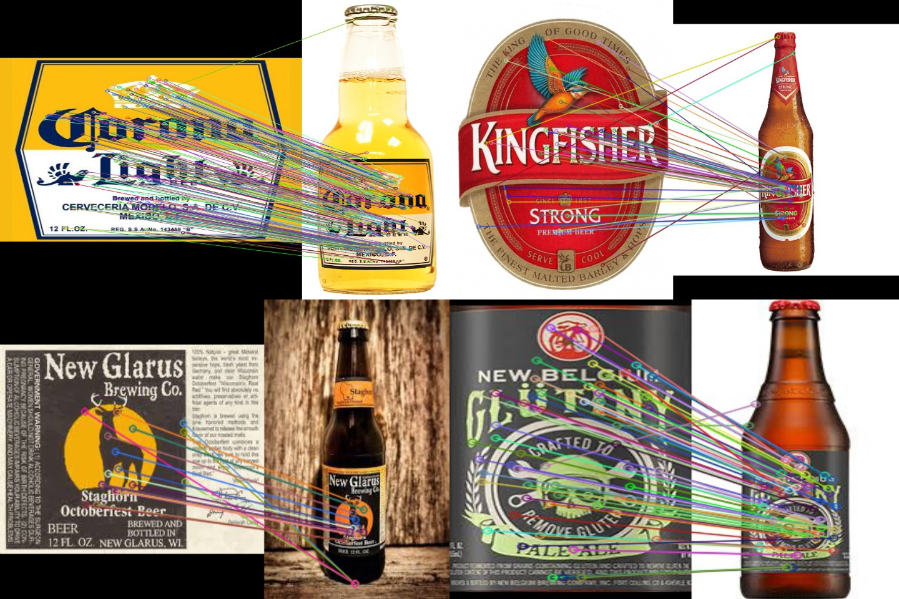
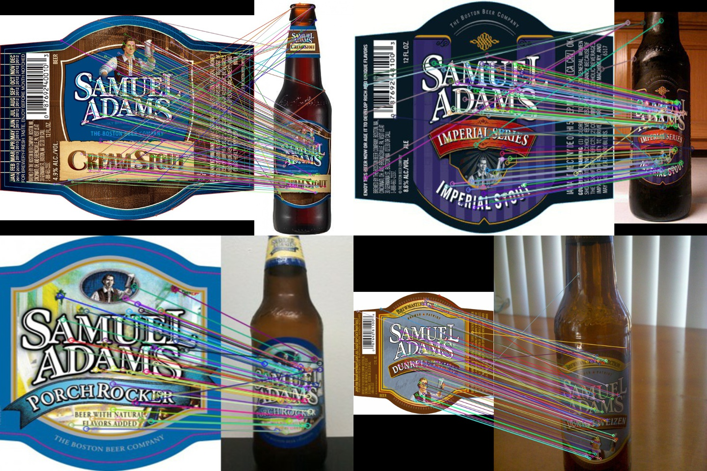

# Beer Label Classification
# Project
Please make sure you follow the project [guidelines](./guidelines.md) carefully.

# Dataset
The entire dataset is downloaded manually by using Google. Our dataset directory structure is given below:
```
images
  ├── database
  ├── query
  ├── samuel_adams
  | ├── database
  | ├── query
```
* The database folder consists of images having clean labels, while query folder consists of beer bottle images which will be use for matching. 
* The primary dataset consits of 100 database and corresponding 100 query images.
* The samuel_adams folder consists of 30 database and corresponding 30 query images for the brewery Samuel Adams
* Each query image has a corresponding database image. 

# Setup
## Dependencies
Python = 3.6+
## Running the code

1. Clone the repo to your local machine. <br>
`git clone https://github.com/Digital-Image-Processing-IIITH/project-dipsum`
2. Move to the project directory.<br>
`cd project-dipsum`
3. Install the require dependencies.<br>
`pip install -r requirements.txt`
4. Create a subfolder for downloading/saving the descriptor file.<br>
`mkdir lookup`

There are primarily two methods to execute the project. 

* First one is executing an end-to-end code which will calculate the sift descriptors of the images in *database* folder and then match the *query* images with the *database* sift descriptors. For this run the following command:<br>
`python src/main.py -load N`

* Second method is to download the pre-computed sift descriptors from the given [link](https://drive.google.com/drive/folders/1MpqePCzHbRZHp1CcloUyFzoDXSFT2hkp?usp=sharing) and put them in *lookup* folder. Now run the following command:<br>
`python src/main.py`

We provide the following arguments:<br>
`-d` Path to the folder containg database images <br>
`-q` Path to the folder containing query images <br>
`-l` Path to the pre computed descriptors file <br>
`-load` If Y/y, It will load the precomputed descriptor from the file provided using **-l**; else run an end-to-end code.

We have also provided an end-to-end script for running Sift on *Samuel Adams* dataset.(This script has the same arguments as main.py and can be executed in a similar fashion)<br>
`python src/samuel_adams_end2end.py -load N` (for end-to-end code execution)<br>
OR<br>
`python src/samuel_adams_end2end.py` (for using the pre-computed SIFT descriptors, downloaded from the link provided above)

# Results
|Dataset| No. Database Images| No. of Query Images|Accuracy(%)|
|---|---|---|---|
| Primary Dataset| 100| 100| 100 |
|Samuel Adams| 30 | 30 | 100 |

## Visualization
We have provided a python script to visualize the feature mapping using SIFT. <br>
`python src/sift_visualization.py` <br>
It take two arguments: <br>
`-d` Path to the database image <br>
`-q` Path to the query image <br>

 <br>
 <br>
